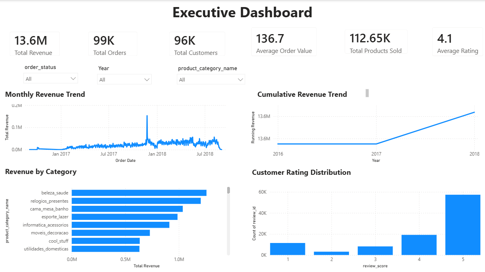
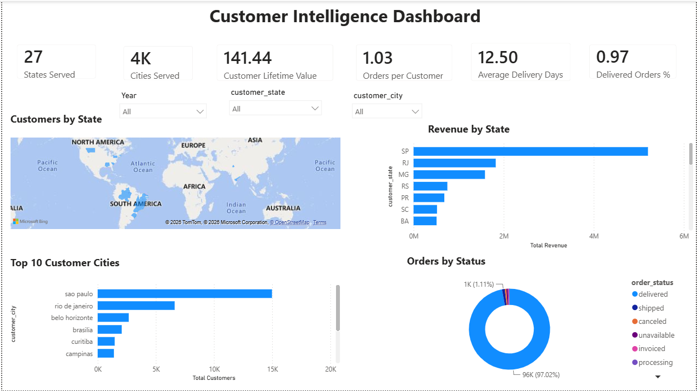
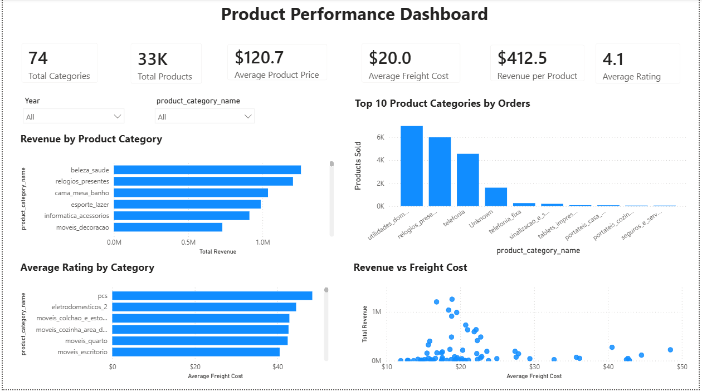
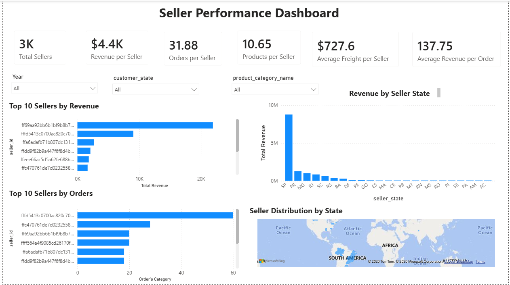
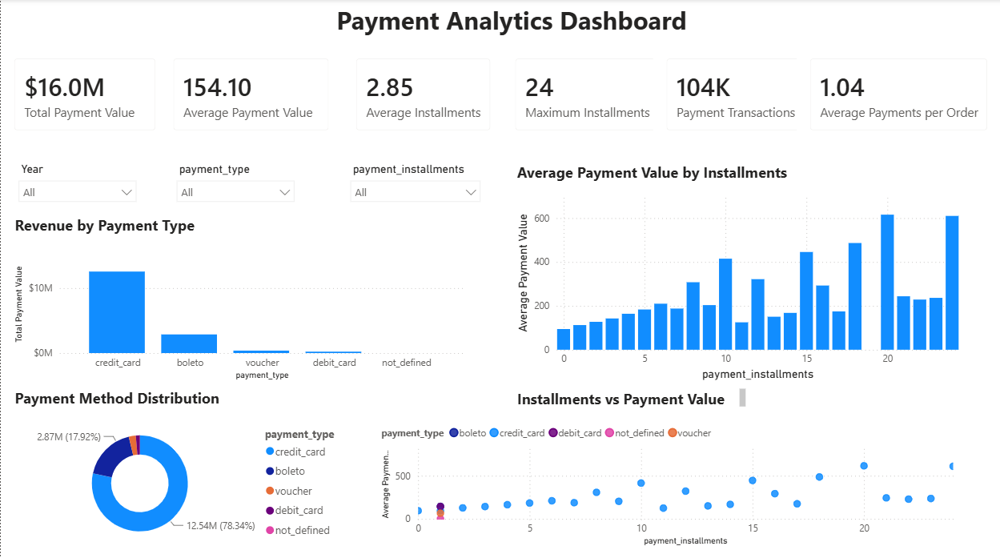
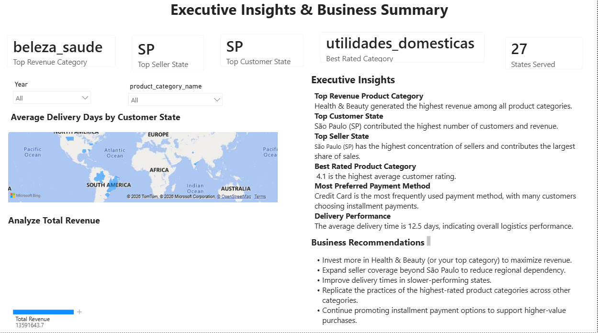

# 📊 Olist E-Commerce Sales Analysis Dashboard

An end-to-end **Business Intelligence (BI)** project developed using **Power BI** to analyze the Olist Brazilian E-Commerce dataset. This dashboard transforms raw transactional data into interactive visualizations that help understand customer behavior, product performance, seller performance, payment trends, and overall business growth.

---

## 📌 Project Overview

This project demonstrates how Power BI can be used to convert large-scale e-commerce data into meaningful business insights through interactive dashboards and data visualization.

The dashboard provides decision-makers with valuable insights into:

- Revenue and sales performance
- Customer purchasing behavior
- Product category performance
- Seller performance analysis
- Payment trends and installment behavior
- Executive-level business insights

---

## 🎯 Business Objectives

The main objectives of this project are:

- Analyze overall sales performance
- Identify high-performing products and categories
- Evaluate customer purchasing patterns
- Analyze seller performance
- Understand payment preferences
- Build an executive dashboard for business decision-making

---

## 🛠️ Tech Stack

| Tool | Purpose |
|------|---------|
| Power BI Desktop | Dashboard Development |
| Power Query | Data Cleaning & Transformation |
| DAX | Measures & Business Calculations |
| CSV Dataset | Data Source |
| Git & GitHub | Version Control & Portfolio |


## 📷 Dashboard Preview

### Executive Dashboard



---

### Customer Intelligence



---

### Product Performance



---

### Seller Performance



---

### Payment & Installment Analysis



---

### Executive Business Insights




## 📊 Key Performance Indicators (KPIs)

The dashboard tracks several important business metrics, including:

- 💰 Total Revenue
- 📦 Total Orders
- 👥 Total Customers
- 🛍️ Total Products Sold
- ⭐ Average Customer Rating
- 🚚 Number of Sellers
- 💳 Payment Method Distribution
- 📈 Monthly Sales Trend
- 🏆 Top Product Categories
- 🌍 Regional Sales Distribution


## 📑 Dashboard Pages

### 1. Executive Dashboard
Provides a high-level overview of business performance, including revenue, orders, customers, and monthly sales trends.

### 2. Customer Intelligence
Analyzes customer distribution, purchasing behavior, repeat customers, and geographic insights.

### 3. Product Performance
Highlights best-selling products, top-performing categories, and sales contribution by products.

### 4. Seller Performance
Evaluates seller performance using sales volume, revenue, and order fulfillment metrics.

### 5. Payment & Installment Analysis
Examines payment methods, installment preferences, and customer payment behavior.

### 6. Executive Business Insights
Summarizes major business findings and provides actionable insights for decision-makers.


## 📁 Project Structure

```
Olist_Ecommerce_Sales_Analysis/
│
├── dashboard/
│   ├── Dashboard.pdf
│   ├── Olist_Ecommerce_Sales_Analysis.pbix
│   ├── page1.png
│   ├── page2.png
│   ├── page3.png
│   ├── page4.png
│   ├── page5.png
│   └── page6.png
│
├── data/
│   └── *.csv
│
└── README.md
```

## 🔮 Future Enhancements

- Forecast future sales trends using machine learning.
- Add customer segmentation with RFM analysis.
- Integrate real-time data sources.
- Publish the dashboard to the Power BI Service.
- Implement row-level security for enterprise use.

## 👨‍💻 Author

**Siddhartha Reddy Salla**

- 🎓 B.Tech – Electronics & Instrumentation Engineering
- 📊 Aspiring Data Analyst & Data Scientist| Power BI | SQL | Python
- 🌐 GitHub: https://github.com/SiddharthaReddy27
---
